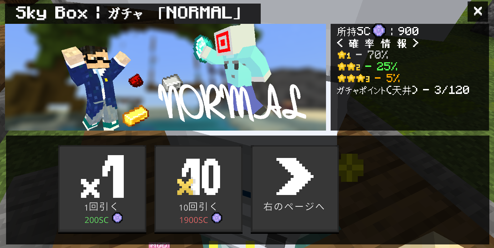

様々なゲームモードで遊ぶことができるPvPミニゲームサーバーです！  
Bed WarsやCore PvPといった定番のPvPモードはもちろん、サーバー独自で開発されたゲームモードも楽しめます。

# 特徴
## カスタムアビリティを使ったPvPシステム
SkyNetworkでは、工夫次第で優位に立ちまわることができる「カスタムアビリティ」というシステムが導入されています。  
ゲーム内で獲得したポイントを使い、自分だけのスキルの組み合わせを作ることができます。それぞれのスキルの特性を活かしてチームを勝利に導きましょう！

**メインスキルの例**
- `剣士`：スキル使用で、１５秒間攻撃力が上昇する
- `暗殺者`：スキル使用で３０秒間透明になれる
- `スカウト`：スニークしながらスキル使用で前方に吹っ飛べる！
- `解体業者`：スキル使用で周囲の羊毛を消し炭にできる！
- `特攻兵`：スキル使用で再生が付与され、３０秒間ノックバックを50%カットできる
- `防衛兵`：スキル使用で近くの敵に弱体化、鈍化、採掘速度低下、盲目を３秒間付与できる

メインスキルに加えてサブスキル・パッシブスキルを組み合わせることで、自分だけのカスタムアビリティを作ることができます！

## 豊富なマップ
有志のプレイヤーが制作した多彩なマップが用意されています。マップごとに異なる戦略が求められるため、毎回新鮮なバトルを楽しむことができます。

**Oasis**

**Present**

# 参加方法
詳しくは[公式サイト](https://www.skynetwork-mcbe.net/how-to-join)をチェック！  
フレンド機能にも対応しているのでSwitchやPS4版でも参加できます。

# 紹介動画
[公式サイトをご覧ください！！](https://www.skynetwork-mcbe.net/play-video)

 
 
 

---
※ガチャも引けます

